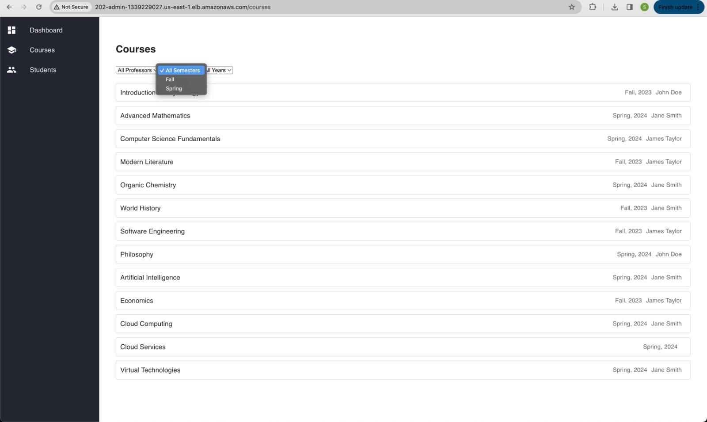

# CMPE 202 - Learning Management System by Team Recursive Rebels

## Introduction

Welcome to the Learning Management System (LMS) developed by Team recursive rebels.Our application provides a comprehensive platform for managing courses, assignments, grades, and user roles efficiently. With features tailored for faculty, students, and administrators, our LMS enhances collaboration and learning outcomes.

## Contribution Summary

### Shireesh:
Developed APIs for Faculty functionalities, including viewing courses, adding syllabus content, managing student lists, grading, adding assignments and quizzes, and posting announcements.
Set up the cloud infrastructure on AWS, including deploying the API and database to an Auto Scaled EC2 Cluster with a Load Balancer.
Integrated various components of the system, ensuring smooth communication between them.

### Ashish:
Implemented login and authentication functionalities for all user roles.
Developed additional Faculty APIs, contributing to functionalities such as course content management and announcements.
Assisted in integrating different components of the system, ensuring seamless operation.

### Lekhana:
Developed APIs and UI components specifically for the Admin role, including viewing courses by faculty, assigning courses to faculty for new semesters, and managing student lists.
Created documentation for the project, ensuring clarity and ease of understanding for future reference.

### Vinay:
Implemented the majority of APIs related to student functionalities, including viewing enrolled courses, accessing course content, viewing grades, and setting profile information.
Designed wireframes for the web or mobile UI, providing visual representations of the user interface elements.

## Sprint Report

[Link to Sprint Report](documentation/Sprint_Notes.xlsx)

## Scrum Backlog Screenshots

Sprint 1

Sprint 2

Sprint 3

Sprint 4

Sprint 5

## Sprint Burndown Chart

[Link to Sprint Burndown Chart ](documentation/SprintTaskSheetandburndown_RecursiveRebels.xlsx)

## Team Members
- Shireesh 
- Ashish 
- Sri Vinay Appari 
- Lekhana

## Scrum Meeting Days

- Wednesday, Saturday

## Technologies Used

- **Frontend**: React
- **Backend**: Node.js, Express.js
- **Database**: RDS SQL
- **Cloud**: AWS

## Tools

- Visual Studio Code
- Git

## XP Core Values

- Communication
- Feedback

Throughout the project, our team adhered to the XP Core Values of Communication and Feedback, which were essential for collaboration, continuous improvement, and shared understanding among team members.

Communication:
We placed a strong emphasis on maintaining open and consistent communication channels to ensure the seamless flow of information within the team. Our primary modes of communication included video conferencing platforms like Zoom and Google Meet, where we conducted regular meetings to discuss project progress, share updates, and address any challenges or concerns that arose. These meetings provided a platform for transparent and open dialogue, allowing team members to express their ideas, seek clarification, and provide feedback. Additionally, we utilised collaboration tools like whatsapp groups and  email for quick updates and asynchronous discussions. By maintaining clear and diverse communication channels, we were able to stay aligned with project goals, promptly resolve issues, and ensure that everyone was well-informed and engaged throughout the project lifecycle.

Constructive Feedback:
Feedback was a cornerstone of our team's success, as it enabled us to continuously improve and adapt our approach. We encouraged an environment where team members felt comfortable providing and receiving feedback in an open and respectful manner. During our meetings, we actively solicited feedback on project progress, ideas and proposed solutions, encouraging everyone to share their perspectives and suggestions for improvement. Furthermore, we conducted regular retrospectives to reflect on our processes, identify areas for growth and discuss strategies for enhancement. By actively seeking and incorporating feedback into our work, we were able to iteratively refine our approach, address challenges effectively and deliver a high-quality solution that met the project requirements and exceeded expectations.

## Use Case Diagram

## Architecture Diagram

## Component Diagram

## Deployment Diagram

## Design Decisions

### Database

**Why RDS SQL?**
- Relational databases provide structured data storage, suitable for complex relationships in an LMS.
- RDS SQL ensures ACID compliance and transactional integrity, crucial for academic data management.

### Rest Over GraphQL

- RESTful APIs simplify error handling and maintain the flexibility of the SQL schema.

### Tech Stack

**Frontend - React:**
- React offers efficient UI rendering and component reusability, enhancing user experience and developer productivity.

**Backend - Node.js, Express.js:**
- Node.js and Express.js provide a robust and scalable backend framework, ideal for handling API requests and business logic.

**Cloud Deployment - AWS:**
- AWS offers reliable and scalable cloud infrastructure, essential for hosting the LMS with high availability and performance.

## Feature Set

**Faculty:**
- View courses taught
- Add content to syllabus
- View student list and grades
- Post announcements
- Add assignments and quizzes

**Student:**
- View enrolled courses
- Access course content
- View grades
- Set profile information

**Admin:**
- View courses and faculty
- Assign courses to faculty
- View student lists

## Screens
Admin

Faculty

User

## Deployment Screenshots

